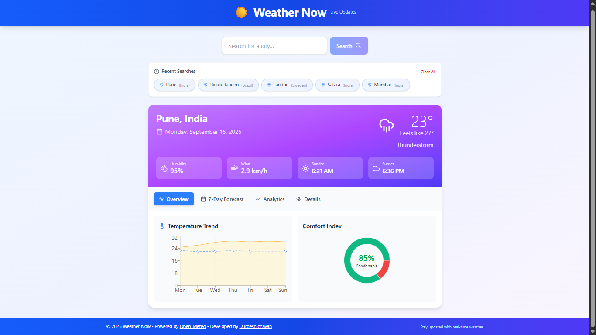

# 🌤️ Weather Now

**[Live Demo](https://weather-app-pearl-eight-55.vercel.app/)**

Weather Now is a modern, user-friendly weather application that provides **real-time weather updates** for any city. Built with **Next.js** and powered by the **Open-Meteo API**, it offers accurate weather data with a clean, responsive interface optimized for both mobile and desktop devices.

---

## 📌 Table of Contents
- [Features](#features)
- [Screenshots](#screenshots)
- [Technologies Used](#technologies-used)
- [Installation](#installation)
- [Usage](#usage)
- [Configuration](#configuration)
- [Deployment](#deployment)
- [Future Improvements](#future-improvements)
- [License](#license)
- [Author](#author)

---

## 🚀 Features
- 🔍 **Search by City**: Easily find weather data for any city or location.
- 🌦️ **Real-Time Updates**: Get instant weather details like temperature, humidity, and conditions.
- 🕒 **Recent Searches**: Access recently searched cities for quick reference.
- ⏳ **Smooth UX**: Loading skeleton UI ensures a seamless experience while fetching data.
- 🌍 **Open-Meteo API**: Reliable, free, and keyless API for weather data.
- 📱 **Responsive Design**: Fully optimized for mobile and desktop.
- ⚡ **Fast Hosting**: Deployed on Vercel for optimal performance.

---

## 📸 Screenshots 


---

## 🛠️ Technologies Used
- **Framework**: [Next.js 14](https://nextjs.org/)
- **Language**: JavaScript (React + JSX)
- **Styling**: [Tailwind CSS](https://tailwindcss.com/)
- **API**: [Open-Meteo](https://open-meteo.com/)
- **Deployment**: [Vercel](https://vercel.com/)

---

## 📥 Installation

To run the project locally, follow these steps:

```bash
# Clone the repository
git clone https://github.com/<your-username>/weather-now.git

# Navigate to the project folder
cd weather-now

# Install dependencies
npm install
# or
yarn install

# Start the development server
npm run dev
# or
yarn dev
